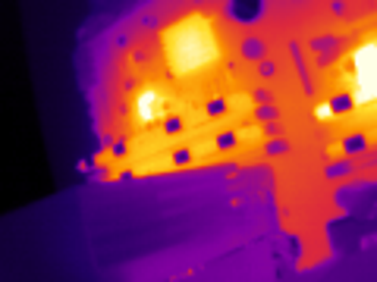

# uti120

Driver, video tools and an Android app for the **UNI-T UTi120Mobile** USB
thermal camera (120×90 microbolometer, USB ID `5656:1201`). This is an
independent open-source implementation; all forms share the same protocol
handling and image processing:

* **Python** (`src/`) — a small library and CLI on pyusb; video goes through
  external `ffmpeg`/`ffplay` processes.
* **C++** (`cpp/`) — a single self-contained executable: USB, calibration,
  H.264/MP4 encoding, PNG and the live window all run in one process, with
  libusb, FFmpeg, x264 and SDL3 linked in statically.
* **Android** (`android/`) — a Kotlin/Jetpack Compose app on the same C++
  backend (`cpp/core`), with the vendor app's screen layout: live image, photo
  and video capture, palettes, mirror/flip/rotate, tap to recalibrate.

## Example



A running PC motherboard, `uti120 snapshot` with the default ironbow palette:
120×90 sensor pixels upscaled ×4, 8 frames averaged; brighter is warmer.

## Install

### C++ (single executable)

```sh
cmake -S cpp -B cpp/build -G Ninja
cmake --build cpp/build          # also downloads and builds the dependencies
cpp/build/uti120 info
```

Build requirements: CMake ≥ 3.20, a C++20 compiler, `make`, `nasm` (for x264)
and network access on the first build. The pinned sources of zlib 1.3.1,
libusb 1.0.29, x264, FFmpeg 8.0 (configured with only the MP4 muxer and the
libx264 and PNG encoders) and SDL3 3.2.24 are verified by SHA-256 and built as
static libraries into `cpp/build/deps`. The resulting executable needs only
libc and libm; for `live`, SDL3 loads the X11 or Wayland client library of the
running desktop at run time (have their development headers installed when
building, or the corresponding SDL3 backend is left out).

`ctest --test-dir cpp/build` runs the offline tests.

The C++ code is split into the backend `cpp/core` (protocol, calibration,
processing, rendering; a static library with no media dependencies) and the
desktop frontend `cpp/desktop` (command line, FFmpeg/x264 encoding, SDL3 window).

### Android

```sh
cd android
echo "sdk.dir=$HOME/Android/Sdk" > local.properties
./gradlew assembleDebug       # app/build/outputs/apk/debug/app-debug.apk
```

Requires the Android SDK with platform 37.2, NDK 28.2.13676358 and CMake
3.31.6 (`sdkmanager "platforms;android-37.2" "ndk;28.2.13676358" "cmake;3.31.6"`).
libusb is downloaded at its pinned, hash-checked release and built with the
NDK; the backend comes from `cpp/core`. Plug the camera into the phone (USB
OTG), allow access when asked; photos go to `Pictures/UTi120`, videos to
`Movies/UTi120`.

### Python

```sh
sudo pacman -S python-pyusb python-numpy python-pillow ffmpeg   # Arch; or pip deps
pipx install .            # or: pip install .
sudo cp udev/70-uni-t-uti120mobile.rules /etc/udev/rules.d/
sudo udevadm control --reload-rules && sudo udevadm trigger
```

The udev rule gives the `wheel` group access to the camera; edit `GROUP` to suit.

## Use

```sh
uti120 info                                  # firmware, sensor id, status
uti120 snapshot -o board.png                 # one image (8 frames averaged)
uti120 record -t 30 -o board.mp4             # 30 s video, 25 fps, 480x360
uti120 record -t 30 --raw board.raw          # ...plus every raw frame, lossless
uti120 live                                  # live window (Esc or q closes it)
```

Common options: `--palette {grey,ironbow,rainbow}`, `--scale N` (upscaling,
default 4), `--mirror`, `--flip`, `--recalibrate SECONDS` (repeat the shutter
calibration periodically during long recordings), `-v` (log; `-vv` protocol
debug).

The image is relative: brighter means warmer, scaled automatically between the
1st and 99th percentile. Radiometric temperatures are not implemented.

## How it works

Protocol recovered from the vendor Android app (`com.unit.usblib.armlib`) and
verified against the device:

| What | Where |
|---|---|
| commands | interrupt OUT `0x01` → reply on interrupt IN `0x81`; `[func, reg, count, values(BE32)...]` |
| register read / write | func `0x05` / `0x04` (system), `0x0B` / `0x0A` (sensor) |
| start streaming | write system register `0xF0` (run status) = 2 |
| request a frame | write single byte `0x81`, read 25600 bytes from bulk IN `0x82` |
| shutter | sensor register 3: 1 = closed, 0 = open |
| on-camera NUC | sensor register 4 = 1 |

Frame layout (little-endian 16-bit words): one header row of 120 words (magic
`0xAA55`, frame counter, geometry 120×92, shutter/tube/FPA temperatures in
0.01 °C, shutter and NUC status), then 92 sensor rows of which the first two are
reference rows and 90 are image, then zero padding, and a CRC-32 of the frame in
the last 4 bytes.

The raw image is dominated by per-pixel offsets. At start-up the program asks the
camera for an NUC, closes the shutter, averages 16 frames as the offset map,
opens the shutter and subtracts that map from every frame; outlier pixels are
replaced by the median of their neighbours.

## Tests

Both implementations are tested offline on frames recorded from a real camera
(`tests/data`):

```sh
python3 -m pytest tests
ctest --test-dir cpp/build
```

## License

The source code in this repository is MIT-licensed. The C++ executable links
x264 and an FFmpeg build configured with `--enable-gpl`, so the executable as a
whole is distributed under the GNU GPL version 2 or later. The Android app
links libusb statically, which is under the GNU LGPL 2.1.
